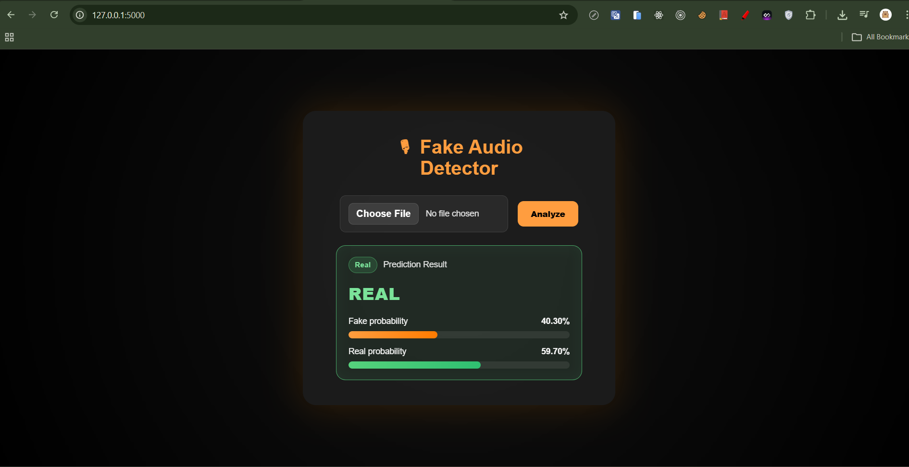
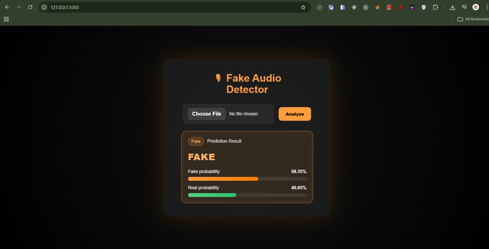

# 🎙 Deepfake Audio Detection

A deep learning project for detecting fake (AI-generated) audio using pretrained speech models like WavLM / Wav2Vec2.

---

## 🧠 Model Overview

- Backbone: `microsoft/wavlm-base`
- Input: Raw audio waveform (16kHz)
- Output: Binary classification (Real / Fake)

### Pipeline:

Audio → Feature Extractor → WavLM → Pooling → Classifier → Prediction

---

## 📁 Project Structure
```
deepfake_audio_detection/
│
├── data/
│ └── test_data/
│         ├── real/
│         │   ├── file1.wav
│         │   └── ...
│         └── fake/
│         │   ├── file1.wav
│         │   └── ...
│ └── train_data/
│         ├── real/
│         │   ├── file1.wav
│         │   └── ...
│         └── fake/
│         │   ├── file1.wav
│         │   └── ...
│ └── train_data_v1/
│         ├── real/
│         │   ├── file1.wav
│         │   └── ...
│         └── fake/
│         │   ├── file1.wav
│         │   └── ...
│
├── uploads/ # uploaded files from web UI
│
├── static/
│ └── styles.css # UI styling
│
├── templates/
│ └── index.html # Flask frontend
│
├── train.py # training script
├── infer.py # inference logic
├── app.py # Flask web app
│
├── best_model.pt # trained model weights
│
├── requirements.txt
└── README.md
```

---

## ⚙️ Installation

### 1. Clone project

```bash
git clone https://github.com/cuongnadev/Deepfake-audio-detection-models.git
cd Deepfake-audio-detection-models
```

### 2. Create virtual environmentt
```bash
python -m venv .venv
```

### 3. Activate environment
>Windows:
```bash
.venv\Scripts\activate
```

>Linux / Mac:
```bash
source .venv/bin/activate
```

### 4. Install dependencies
```bash
pip install -r requirements.txt
```

---

## 🚀 Demo

Upload an audio file and get prediction:

- Real or Fake
- Confidence scores




---