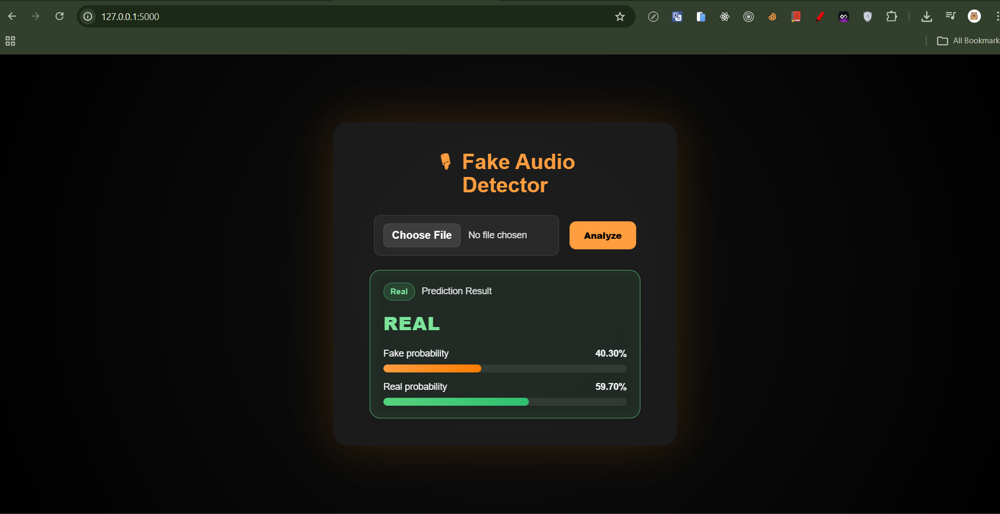
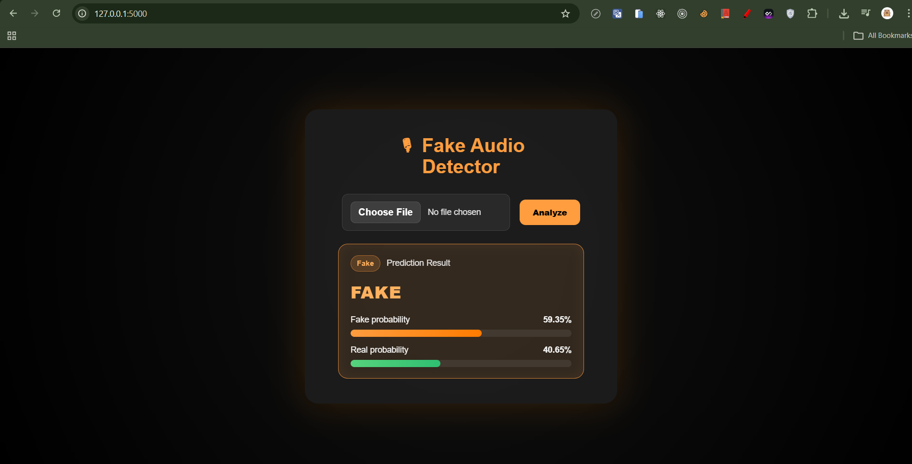

# 🎙 Deepfake Audio Detection

A deep learning project for detecting fake AI-generated audio using pretrained speech representation models such as **WavLM** and **HuBERT**.

This project uses three dataset configurations:

1. **FoR**  
   The Fake-or-Real Dataset is a deepfake audio dataset designed for synthetic speech detection. In this project, it is used as one of the main training and evaluation datasets.  
   Source: [The Fake-or-Real Dataset on Kaggle](https://www.kaggle.com/datasets/mohammedabdeldayem/the-fake-or-real-dataset)

2. **SceneFake**  
   SceneFake is a scene fake audio detection dataset. It focuses on manipulated audio where the acoustic scene/background is tampered with while preserving speech content. This makes it useful for evaluating whether a model can detect fake audio beyond simple synthetic speech generation.  
   Source: [SceneFake on Kaggle](https://www.kaggle.com/datasets/mohammedabdeldayem/scenefake)

3. **Merged**  
   The merged dataset is created by combining the processed FoR and SceneFake datasets. It is used to train a model on a larger and more diverse dataset.

This project also uses a separate external test dataset:

4. **Real vs Fake Human Voice – Deepfake Audio Dataset**  
   This dataset contains real human voice recordings and AI-generated fake voice samples. It is used as an independent test set to evaluate how well the trained model generalizes to unseen data from a different source.  
   Source: [Real vs Fake Human Voice – Deepfake Audio Dataset on Kaggle](https://www.kaggle.com/datasets/unidpro/real-vs-fake-human-voice-deepfake-audio)

---

## 🧠 Model Overview

This project uses pretrained speech models as feature extractors/backbones and adds a custom classification head for binary audio deepfake detection.

### Supported Backbones

- `microsoft/wavlm-base`
- `facebook/hubert-base-ls960`

### Input / Output

- **Input**: Raw audio waveform
- **Sampling rate**: 16kHz
- **Audio formats**: `.wav`, `.mp3`
- **Output**: Binary classification
  - `0`: Real
  - `1`: Fake

### Pipeline

```text
Audio File
   ↓
Load + Resample + Normalize
   ↓
Feature Extractor
   ↓
WavLM / HuBERT Backbone
   ↓
Mean + Std Pooling
   ↓
Classifier Head
   ↓
Real / Fake Prediction
```

---

## 📁 Project Structure
```text
deepfake_audio_detection/
│
├── data/
│   ├── FoR/
│   │   ├── train_set/
│   │   │   ├── fake/
│   │   │   └── real/
│   │   └── eval_set/
│   │       ├── fake/
│   │       └── real/
│   │
│   ├── SceneFake/
│   │   ├── train_set/
│   │   │   ├── fake/
│   │   │   └── real/
│   │   └── eval_set/
│   │       ├── fake/
│   │       └── real/
│   │
│   └── Merged/
│       ├── train_set/
│       │   ├── fake/
│       │   └── real/
│       └── eval_set/
│           ├── fake/
│           └── real/
│
├── uploads/
│   └── uploaded audio files from the web UI
│
├── static/
│   └── styles.css
│
├── templates/
│   └── index.html
│
├── assets/
│   ├── demo_1.png
│   └── demo_2.png
│
├── train_audio_deepfake.py
├── chart.py
├── infer.py
├── app.py
│
├── best_model.pt
├── requirements.txt
└── README.md
```

---

## 📊 Dataset Setup

Each dataset must follow this structure:

```text
DatasetName/
├── train_set/
│   ├── fake/
│   └── real/
└── eval_set/
    ├── fake/
    └── real/
```

Example:

```text
data/FoR/train_set/fake
data/FoR/train_set/real
data/FoR/eval_set/fake
data/FoR/eval_set/real
```

The training script expects the dataset to be balanced as much as possible:

```text
train_set = 80%
eval_set  = 20%

fake = real
```

Supported audio file extensions:

```text
.wav
.mp3
.WAV
.MP3
```

## ⚙️ Installation

### 1. Clone project

```bash
git clone https://github.com/cuongnadev/Deepfake-audio-detection-models.git
cd Deepfake-audio-detection-models
```

### 2. Create virtual environmentt
```bash
python -m venv .venv
```

### 3. Activate environment
>Windows:
```bash
.venv\Scripts\activate
```

>Linux / Mac:
```bash
source .venv/bin/activate
```

### 4. Install dependencies
```bash
pip install -r requirements.txt
```

---

## 🚀 Training

The training script supports three dataset modes:

```python
dataset_mode: str = "scene"
dataset_mode: str = "for"
dataset_mode: str = "merged"
```

It also supports two pretrained models:

```python
model_choice: str = "wavlm"
model_choice: str = "hubert"
```

---

## 🧪 Suggested Experiments

Run the experiments in this order to compare model performance across datasets and backbones.

### WavLM Experiments

```text
1. SceneFake + WavLM
2. FoR       + WavLM
3. Merged    + WavLM
```

### HuBERT Experiments

```text
4. SceneFake + HuBERT
5. FoR       + HuBERT
6. Merged    + HuBERT
```

---

## 🏋️ Train with SceneFake

In `train_audio_deepfake.py`, set:

```python
dataset_mode: str = "scene"
model_choice: str = "wavlm"
```

Then run:

```bash
python train_audio_deepfake.py
```

---

## 🏋️ Train with FoR

In `train_audio_deepfake.py`, set:

```python
dataset_mode: str = "for"
model_choice: str = "wavlm"
```

Then run:

```bash
python train_audio_deepfake.py
```

---

## 🏋️ Train with Merged Dataset

In `train_audio_deepfake.py`, set:

```python
dataset_mode: str = "merged"
model_choice: str = "wavlm"
```

Then run:

```bash
python train_audio_deepfake.py
```

---

## 🔁 Train with HuBERT

To use HuBERT instead of WavLM, change:

```python
model_choice: str = "hubert"
```

This will use:

```text
facebook/hubert-base-ls960
```

---

## 📈 Evaluation Metrics

During training, the script reports:

- Loss
- Accuracy
- Precision
- Recall
- F1-score
- AUC
- Confusion Matrix
- Specificity

Example output:

```text
Train | Loss: 0.2145 | Acc: 0.9231 | Precision: 0.9182 | Recall: 0.9305 | F1: 0.9243 | AUC: 0.9712
Eval  | Loss: 0.3018 | Acc: 0.8874 | Precision: 0.8810 | Recall: 0.8962 | F1: 0.8885 | AUC: 0.9437
CM    | TN: 1024 | FP: 121 | FN: 98 | TP: 1047 | Specificity: 0.8943
```

The best model is saved based on validation F1-score.

---

## 💾 Model Checkpoints

The best model is saved automatically to:

```text
/kaggle/working/best_<dataset_mode>_<model_choice>.pt
```

Examples:

```text
best_scene_wavlm.pt
best_for_wavlm.pt
best_merged_wavlm.pt
best_scene_hubert.pt
best_for_hubert.pt
best_merged_hubert.pt
```

---

## 🧪 Kaggle Dataset Path

When running on Kaggle, the default dataset root is:

```python
data_root = "/kaggle/input/datasets/anhcngnguyn/deepfake-audio-dataset"
```

Expected Kaggle structure:

```text
/kaggle/input/datasets/anhcngnguyn/deepfake-audio-dataset/
├── FoR/
├── SceneFake/
└── Merged/
```

---

## 🔍 Check Dataset Structure

You can use the dataset checking script to verify that Kaggle has mounted the dataset correctly.

```python
import os

dataset_path = "/kaggle/input/datasets/anhcngnguyn/deepfake-audio-dataset"

print("Dataset path:", dataset_path)

if not os.path.exists(dataset_path):
    print("Dataset path was not found.")
else:
    print("\nDataset directory contents:")
    print(os.listdir(dataset_path))

    dataset_names = ["FoR", "SceneFake", "Merged"]

    for dataset_name in dataset_names:
        dataset_root = os.path.join(dataset_path, dataset_name)

        print("\n" + "=" * 60)
        print(f"Checking dataset: {dataset_name}")
        print("=" * 60)

        if not os.path.exists(dataset_root):
            print(f"Dataset folder was not found: {dataset_root}")
            continue

        print(f"\nContents of {dataset_name}:")
        print(os.listdir(dataset_root))

        for split in ["train_set", "eval_set"]:
            split_path = os.path.join(dataset_root, split)

            print(f"\n{dataset_name}/{split}:")

            if not os.path.exists(split_path):
                print(f"Split folder was not found: {split_path}")
                continue

            print("Contents:", os.listdir(split_path))

            for label in ["fake", "real"]:
                label_path = os.path.join(split_path, label)

                if not os.path.exists(label_path):
                    print(f"Label folder was not found: {label_path}")
                    continue

                audio_files = [
                    file_name
                    for file_name in os.listdir(label_path)
                    if file_name.lower().endswith((".wav", ".mp3"))
                ]

                print(f"{label}: {len(audio_files)} files")
```

---

## 🌐 Web Demo

The project includes a Flask web application for testing audio files through a simple UI.

Run:

```bash
python app.py
```

Then open the local URL in your browser.

The demo returns:

- Predicted label: Real / Fake
- Confidence scores

---

## 🖼 Demo





---

## 🛠 Tech Stack

- Python
- PyTorch
- Torchaudio
- Hugging Face Transformers
- Scikit-learn
- Flask
- HTML / CSS

---

## 📌 Notes

- The model currently supports `.wav` and `.mp3` audio files.
- All audio is resampled to 16kHz before being passed into the model.
- The default clip length is 4 seconds.
- Longer audio files are cropped.
- Shorter audio files are padded.
- For fair comparison, datasets should be balanced between fake and real classes.
- For reliable evaluation, `train_set` and `eval_set` should follow an 80/20 split.

---

## 📄 License

This project is for research and educational purposes.
